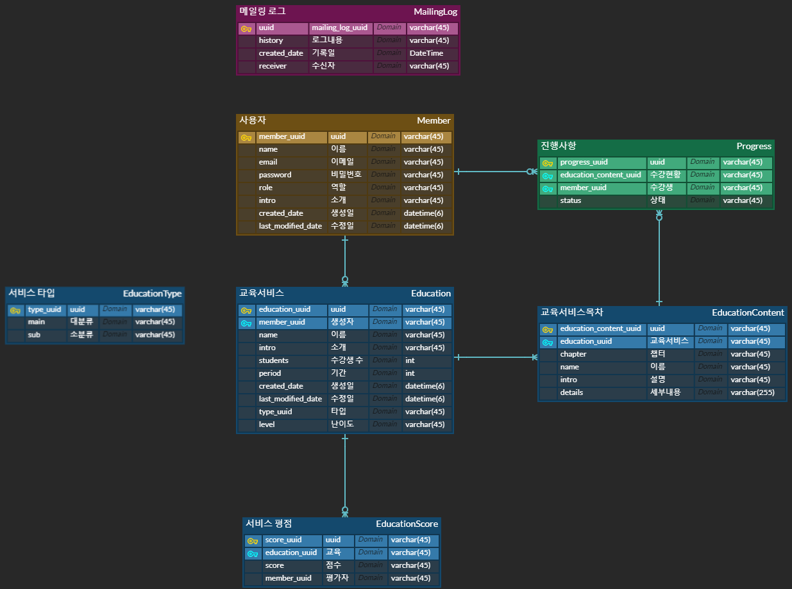
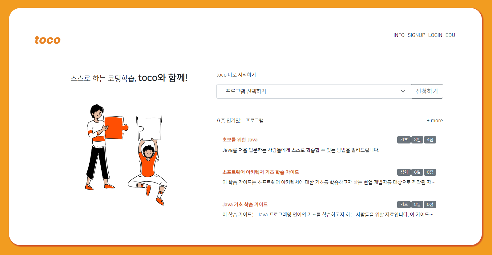
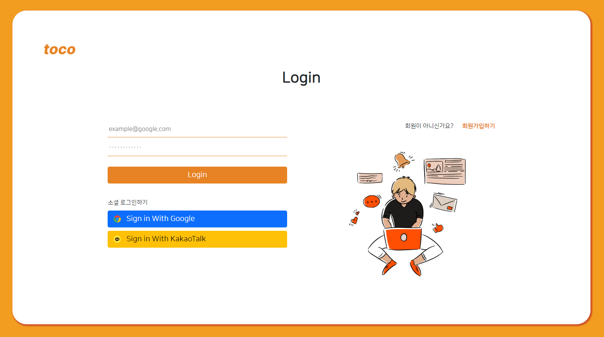
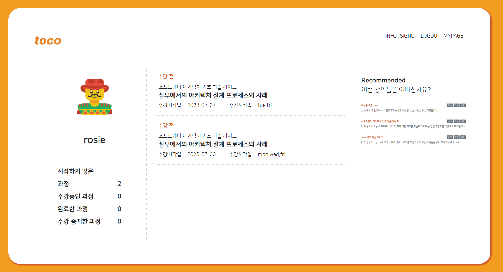
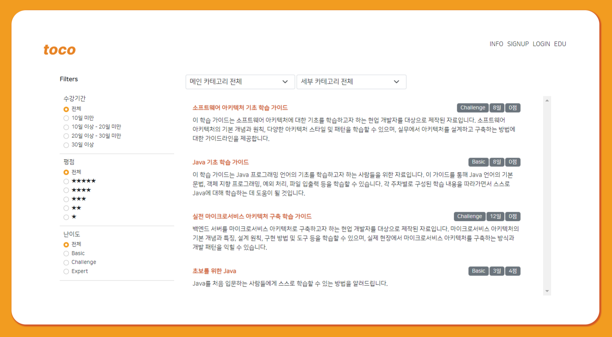
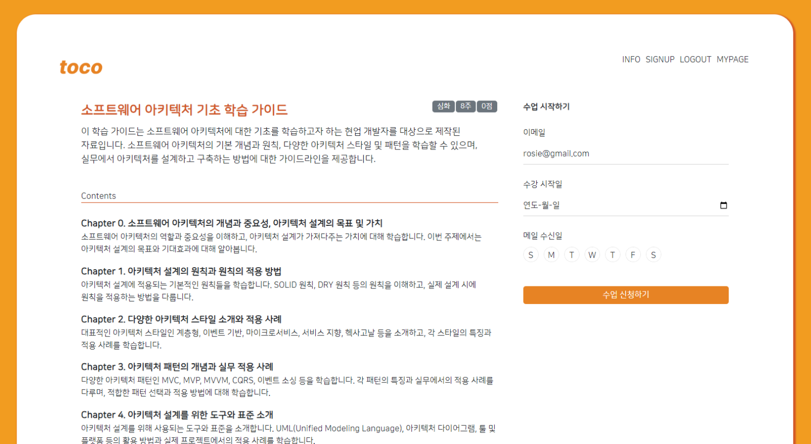
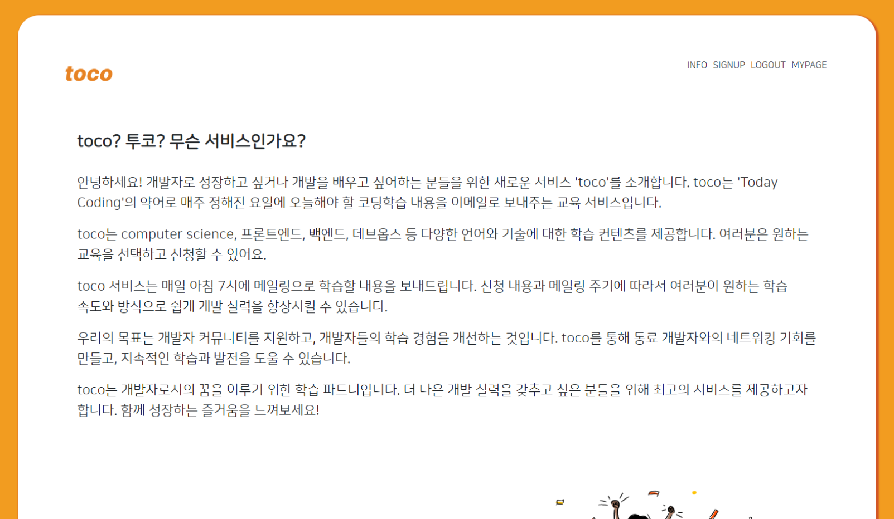

# toco! 개발자를 위한 메일링 학습 서비스

  

    

 

## 프로젝트 소개
개발자로 성장하고 싶거나 개발을 배우고 싶어하는 분들을 위한 새로운 서비스 'toco'를 소개합니다. toco는 'Today Coding'의 약어로 매주 정해진 요일에 오늘해야 할 코딩학습 내용을 이메일로 보내주는 교육 서비스입니다.
### 개발기간
+ 2023.06 ~ 진행중
### 프로젝트 목적
1인 프로젝트로 회사에서 업무를 하면서 습득한 지식 및 김영한님 로드맵 강좌 수강 후 내용을 적용해보기 위한 프로젝트입니다. 핵심 프로젝트 목적들은 다음과 같습니다.
+ JPA 연관관계에 대한 이해, Querydsl 적용
+ 테스트 코드 작성 습관
+ SpringBoot 3.x 버전에서의 Spring security 업데이트 확인
### 기술스택
+ Java 17, SpringBoot 3.0.1, JPA, Querydsl, Thymeleaf
+ MySQL 
+ HTML5, CSS3, JQuery

  

## 프로젝트 설계
### ERD

    

### 프로젝트 뷰
| 메인페이지                                                 | 로그인 & 회원가입 페이지                                    | 마이페이지                                                 |
|----------------------------------------------------------|---------------------------------------------------------|----------------------------------------------------------|
|  |  |  |

| 서비스 리스트 페이지                                        | 서비스 상세 페이지                                               | 서비스 소개 페이지                                          |
|---------------------------------------------------------|----------------------------------------------------------|----------------------------------------------------------|
|  |  |  |
